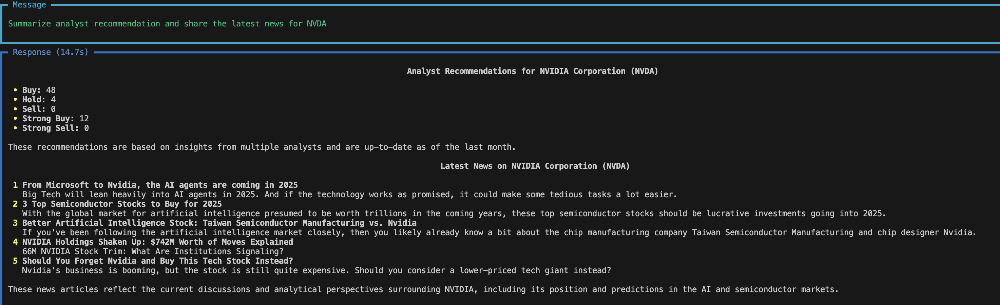

# FinanceAgentAI
Answers  financial data queries


# AI Agent Playground

This project sets up two AI agents using the `phi` library: one for web search and one for financial information. The agents are served through a Playground app, allowing for interactive use.

## Prerequisites

- Python 3.7 or higher
- `pip` (Python package installer)

## Setup

1. **Clone the Repository**

   ```bash
   git clone https://github.com/yourusername/ai-agent-playground.git
   cd ai-agent-playground


# Create a new environment with Python 3.9
conda create -p mylangchainenv python==3.12  


# Activate the new environment
conda activate mylangchainenv

# List all environments to verify
conda env list


pip install -r requirements.txt


Create a .env file in the root directory of your project and add your API keys:

OPENAI_API_KEY=your_openai_api_key
GROQ_API_KEY=your_groq_api_key
PHI_API_KEY=your_phi_api_key

## Run the Application

python finance_agent.py

Detailed Explanation:

Code Explanation

The main components of the project are:

Agents: Defined using the phi.agent.Agent class.
Models: Using the Groq model from phi.model.groq.
Tools: YFinanceTools for financial data and DuckDuckGo for web search.
Playground: An interactive app created using phi.playground.Playground.

Imports:

from phi.agent import Agent: Imports the Agent class, which is used to create agents.
from phi.model.groq import Groq: Imports the Groq model, which is used by the agents.
from phi.tools.yfinance import YFinanceTools: Imports tools for financial data from Yahoo Finance.
from phi.tools.duckduckgo import DuckDuckGo: Imports tools for web search using DuckDuckGo.
from phi.playground import Playground, serve_playground_app: Imports the Playground class and serve_playground_app function to create and serve the app.
import phi.api: Imports the phi.api module for API key management.
import openai: Imports the openai module for interacting with OpenAI's API.
import os: Imports the os module for operating system interactions.
from dotenv import load_dotenv: Imports the load_dotenv function to load environment variables from a .env file.
Load Environment Variables:

load_dotenv(): Loads environment variables from a .env file into the environment.
Access Environment Variables:

openai_api_key = os.getenv('OPENAI_API_KEY'): Retrieves the OpenAI API key from the environment variables.
GROQ_API_KEY = os.getenv('GROQ_API_KEY'): Retrieves the GROQ API key from the environment variables.
phi.api.api_key = os.getenv("PHI_API_KEY"): Sets the PHI API key in the phi.api module.
Print API Keys:

print(f"OpenAI API Key: {openai_api_key}"): Prints the OpenAI API key to verify it is loaded correctly.
print(f"Other Variable: {GROQ_API_KEY}"): Prints the GROQ API key to verify it is loaded correctly.
Define the Web Search Agent:

web_search_agent = Agent(...): Creates an agent named "Web Search Agent" with the role of searching the web for information. It uses the Groq model and the DuckDuckGo tool. The agent is instructed to always include sources, show tool calls, and format responses in Markdown.
Define the Finance Info Agent:

finance_agent = Agent(...): Creates an agent named "Finance Info Agent" with the role of searching the web for financial information. It uses the Groq model and the YFinanceTools tool. The agent is instructed to use tables to display data, show tool calls, and format responses in Markdown.
Create the Playground App:

app = Playground(agents=[finance_agent, web_search_agent]).get_app(): Creates a Playground app with the defined agents and gets the app instance.
Serve the Playground App:

if __name__ == "__main__":: Checks if the script is being run directly.
serve_playground_app("playground:app", reload=True): Starts the Playground app with reloading enabled, allowing for live updates during development.

## Demo


